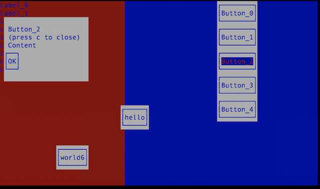

# termgui

 * Command line graphical user interface Ruby toolkit.
 * Create desktop-like interfaces in the command line.
 * Personal ruby-learning project right now
 * 100% ruby, no binaries, no dependencies
 * some ideas taken from npm.org/blessed


### TODO / Status

See [TODO](TODO.md)


## Motivation

 * I didn't found ncurses/blessed library gem implemented 100% in ruby (only ncursed which is C BTW)
 * I'm the author of npm.org/accursed which is a similar library so I can of already implemented this in JavaScript
 * I'm getting started with ruby and I want to master it
 * Many helpers, mappings can be reused from npm.org since js objects are valid ruby maps {}
   * boxes: json
   * color names / mapping (js objects)
   * easing: simple js math-related functions easily to translate to ruby

## Usage
```
gem install termgui # TODO
```

### Example

```rb
require 'termgui'

screen = Screen.new
screen.install_exit_keys

left = Col.new(width: 0.4, height: 0.99, style: { bg: 'red' })
(0..8).map { |i| left.append_child Label.new(text: "Label_#{i}") }
right = Col.new(width: 0.6, height: 0.99, x: 0.4, style: Style.new(bg: 'blue'))
(0..4).map do |i|
  right.append_child Button.new(
    text: "Button_#{i}", x: 0.5,
    action: proc { open_modal(screen: screen, title: "Button_#{i}") }
  )
end
[left, right].each { |widget| screen.append_child widget }

screen.start
```

Result:



### low level (working) example

```rb
require 'termgui'

screen = Screen.new

# install exit keys, by default 'q' will quit the program
screen.install_exit_keys

# when user press 's' we clear the screen and paint a rectangle full with 's' char
screen.event.add_key_listener("s", Proc.new { |e|
  rect=Element.new 2,3,4,3,'S'
  screen.clear
  rect.render screen
})

# starts reading user input.
screen.start
```


## Development commands

cd termui
bundler install
sh bin/test
sh bin/dev   # rails server
sh bin/watch # tests in watch mode


## Element attributes

Some high level element attributes implemented:

### style-cascade

By default, children inherit parent style. If element.get_attribute('style-cascade') == 'prevent' it won't happen - this is the children won't be affected by its parent style and only its own is rendered. 

### focusable, focused and screen.focus.keys, focus, blur

elements with focusable attribute will be able to be focused when user press focus keys (configurable in screen.focus.keys ). By default screen.focus.keys ==  { next: ['tab'], prev: ['S-tab'] }. 

focusable elements will emit "focus" and "blur" events

When focused, the attribute focused will be true and the element is able to receive "action" event (see actionable, action-keys below)

### actionable, action-keys, action

this is useful to implement actionable widgets like buttons that, when focused, can emit "action" events when certain keys are pressed (by default ENTER)

focused elements with attribute "actionable" will emit "action" events if user press action-keys (enter by default) when they are focused. Action keys can be configured globally using screen.action.keys or by element with attribute action-keys. Both could be a string or array. 

### enterable, entered, change, input, escape, escape-keys

This is useful to implement textarea / textinput widgets for which we don't want to trigger focus or action events when user is writing text. When an enterable element (that also should be focusable) receives "action" it is set to "entered" mode. (whey you are writing text, you want TAB S-tab, enter, etc to actually insert characters and don't emit "focus" "action", etc events...)

When an element is on this mode (only one at a time) the rest of the elements will stop receiving common events like focus or action until it leaves the entered mode. . This could happen programmatically or by receiving "escape" event, by default pressing ESC will provoke "escape" event which will set entered = false and enable normal events again (like focus, action, etc). When entered==true, the entered element will listen for input independently and emit "input" events. 

the enter event by default is provoked by "action" (enter) so it can be configured individually using action-keys. 

the escape event by default pressing "escape" can be configurable per element using attribute escape-keys (just like action-keys)

TODO: configure to better play with focus: enter-on-focus to automatically "entered" without "action" and automatically "escape" on "blur" (focus will keep working on this case). Also is not clear how escape plays with change 


## Performance notes

 * disabling renderer buffer speeds up rendering about 30%: `screen.renderer.no_buffer = true`. Genereally don't needed in production.


## API example prototypes (WIP)

** initial design stories**

### layout

TODO  / proposal

```
require 'termgui'
class AppExplorer < Column
  def initialize(model)
    super
    @model=model
    @text = append_child(text: Textarea.new model.text, onChange: {|e| print e.key})
    @text.onChange {|e| print e.key}
  end
end
screen = Screen.new
main = Row.new
left = main.append_child(Column.new 0.3)
right = main.append_child(Column.new 0.7)
explorer = left.append_child(AppExplorer.new model)
editor = right.append_child(AppEditor.new model)
screen start
```

### structure

TODO  / proposal

```
class MyWidget < Column
  def initialize
    super 0.5
    append_children [
      {type: Row, height: 0.6, children: [
        {type: Input, value: 'edit me', width: 0.5, onChange: {|e|print e} },
        {type: Label, text: 'edit me'},
      ]}
      {type: Button, text: 'click me', onClick: {|e|print e}},
    ]
  end
end
```

#### aside

```
{type: Button, text: 'click me', onclick: {|e|print e}},
vs
Button.new text: 'click me', onclick: {|e|print e}},

{type: Row, height: 0.6, children: [
  {type: Input, value: 'edit me', width: 0.5, onChange: {|e|print e} },
  {type: Label, text: 'hello'},
]}
vs
Row.new height: 0.6, children: [
  Input.new value: 'edit me', width: 0.5, onChange: {|e|print e},
  Label new: label: 'hello'
]
```

### style

style = {
  '.primary': {
    bg: 'red',
    fg: 'black'
    bold: true
  }
}
screen.append_child(Column.new children: [
  Label.new text: 'are you sure?',
  Button.new
])


### high level no layout

TODO / proposal

```
s=Screen.new
b=Button.new(parent: s.document, width: 0.3, height: 0.3, left: 0, top: 0, label: 'click me', onClick: { |e| alert "#{e.target.label} clicked!" })
s.start
```

### example low level

(no HTML DOM at all, just drawing)
```
screen = Screen.new
screen.renderer.rect(2,3,9,3,'-', {fg: 'yellow', bg: 'gray'})
screen.renderer.text(x: 3, y: 4,text; 'click me', style: Style.new(fg: '#ffee11', bg: 'black', bold: true))
```

### events

```
screen=Screen.new
screen.event.add_listener('key', {|e| exit 0 if e.key=='q'})
renderer.text(text: 'press q to exit')
```


## Design

### concepts

Screen: contains document, renderer, buffer, Input

Renderer: responsible of drawing given pixels to the terminal

Buffer: maintains screen as bitmap structure (so users can read the current screen contents like a bitmap)

Document: Node subclass analog to html's (access to parent screen)

Node: DOM like representation analog to html's (children, attributes)

Element: Node subclass analog to html's (border, margin, padding)

Input: responsible of user input - notifies screen - emitter

## Summary

I'm author of npm.org/flor that although has superior terminal support (tput) I would like to re implement a similar library for ruby, writing it from scratch (currently learning ruby).

 * low level html-canvas like to set attributes and write strings
  * try to stick to html canvas api for Renderer
  * user is responsible of setting the 'active style' like canvas' stroke-width - this simplifies renderer
 * renderer of styled strings supporting cursor management,
  *  responsible of translating user's `{bg: 'red', s: 'hello'}` into a string with ansi codes
 * screen maintains a virtual Buffer so current drawn screen can be accessed like a bitmap
 * a DOM like API for children, attributes, box model, style
  * supports user input events also like html dom EventSource (element.add_listener('key', ...))
  * basic widget implementations: button,input,textarea
 * style: fg, bg, ch, bold, etc.
 * focus management: focused/focusable - element.style.focus
 * input event loop : set_timeout
 * easy keyboard event representation and API

## Future

add features from npm.org/flor:

 * scroll (element.scrollX=0.2) - dom support
 * a xmlish syntax for defining GUI.
   * support function attributes for event handlers as ruby fragments

## Side projects

 * cli/driver for ruby : for properly testing termgui we need cli-driver for ruby. see probes/stdin.rb for working exec and writing to process stdin async


## Design notes

TODO

Screen, renderer, input are responsible of basic terminal styles like bg, fg, bold, etc.

On top of the screen, renderer and input a document object model like HTML DOM is supported. See Node, Element, Style, etc. Some features based on HTML supported are:

 * box model similar
 * children rendering
 * text
 * element query
 * border
 * padding

Some high level utilities, like the focus/action management, work on top of this DOM so probably 99% of users will want to go that way for building their GUIs.
